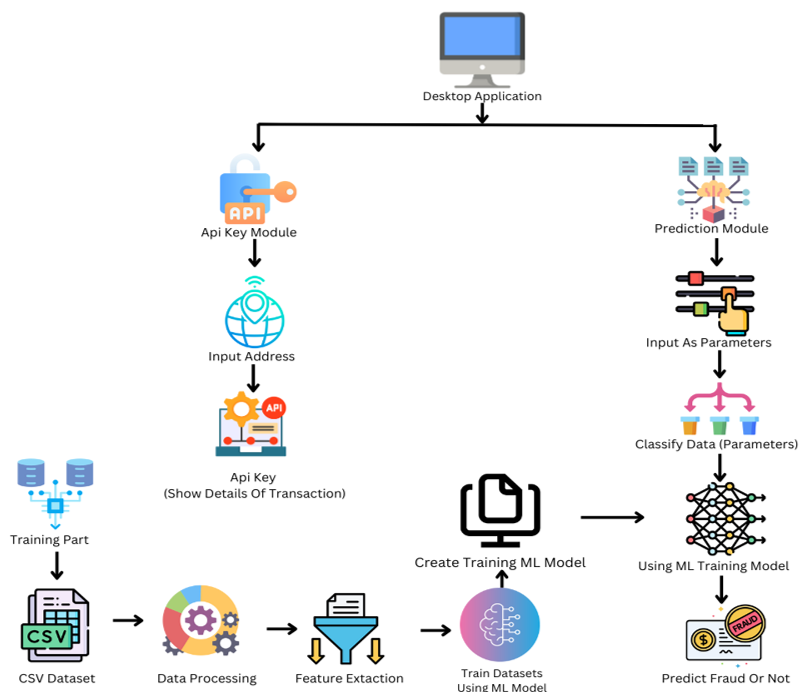
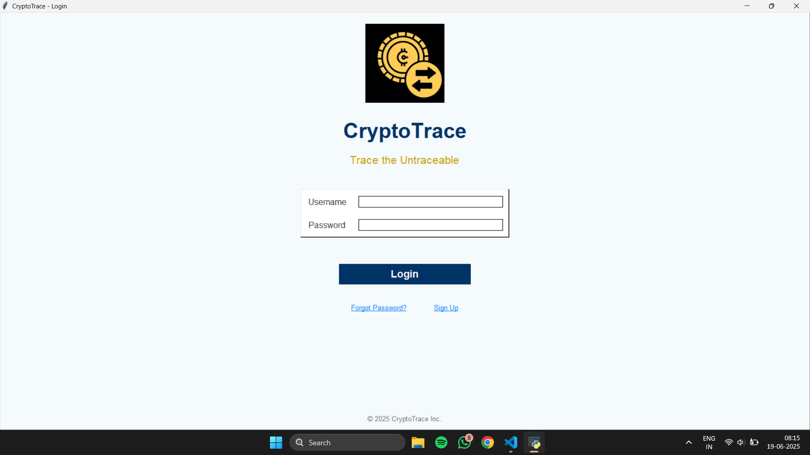
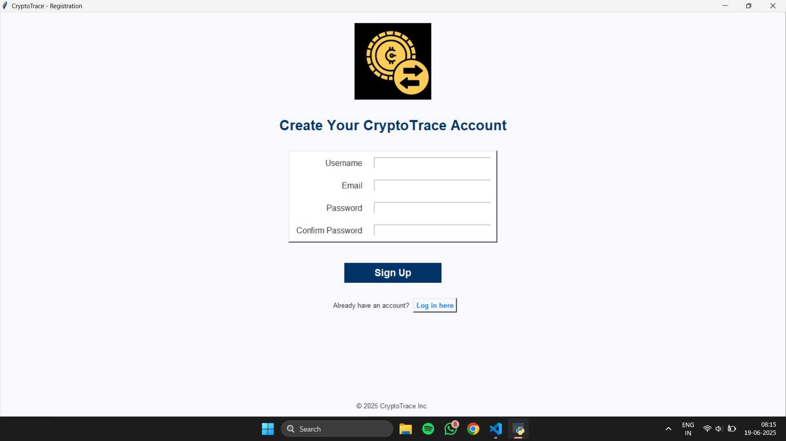
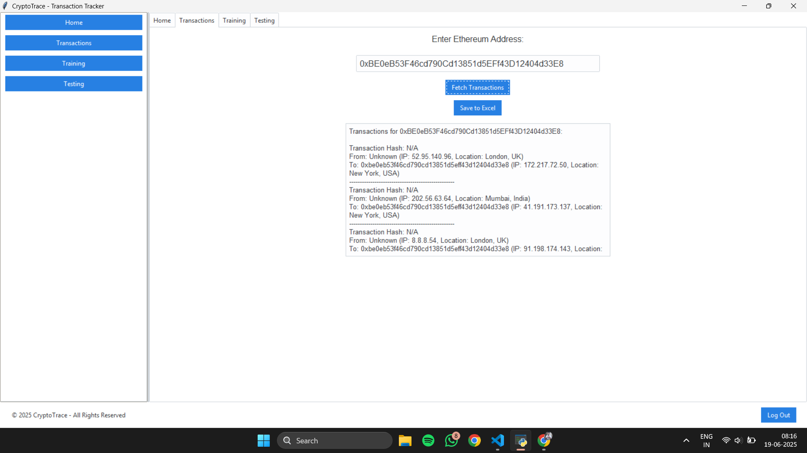
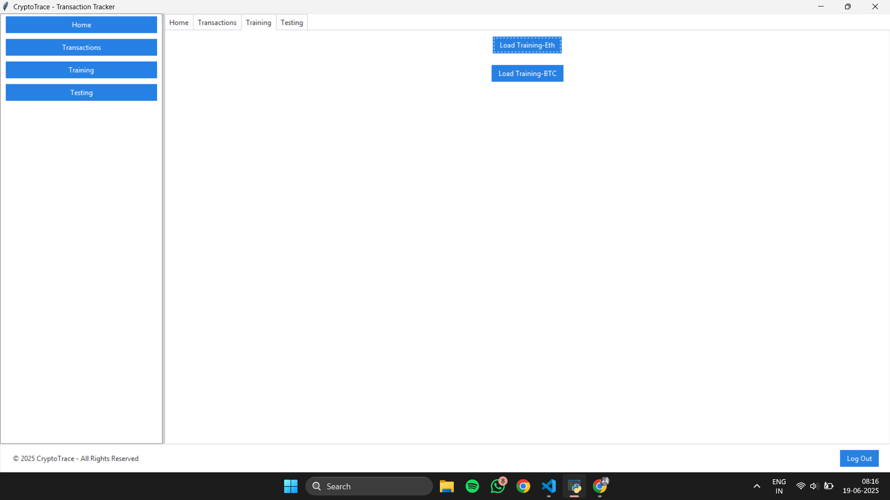
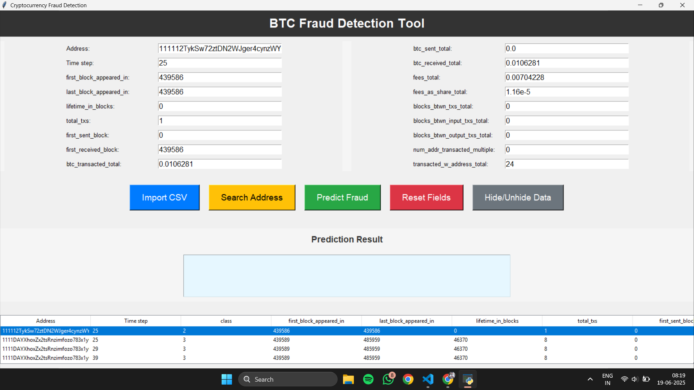
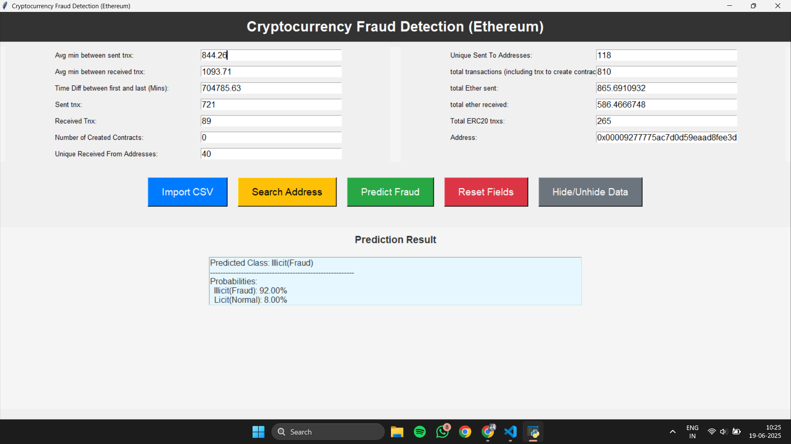
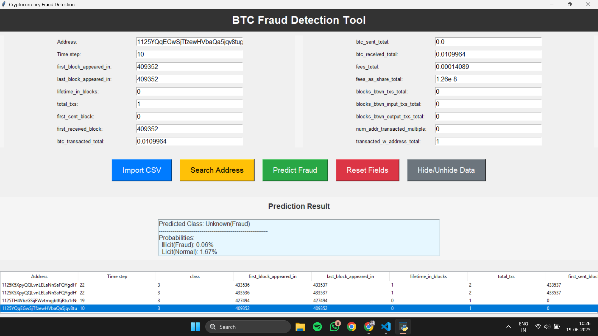
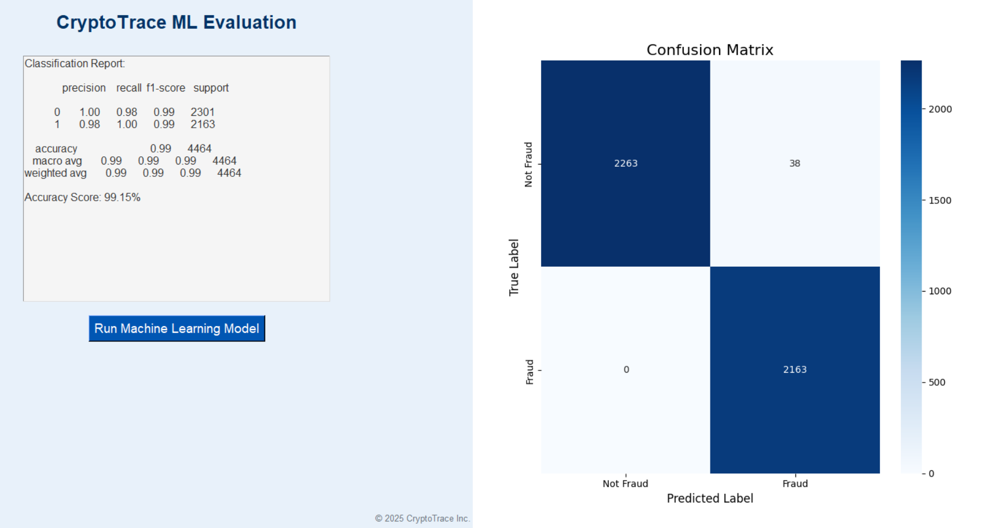

# 📘 CryptoTrace – Real-Time Cryptocurrency Fraud Detection

An AI-powered blockchain forensics system designed to monitor and detect suspicious cryptocurrency transactions across Ethereum and Bitcoin networks.

---

## 🚀 Project Overview

**CryptoTrace** is a real-time fraud detection tool developed for **Smart India Hackathon 2024 (SIH1783)**.

It helps investigators and analysts identify:

- Suspicious crypto wallets
- Fraudulent transaction patterns
- High-risk blockchain activity

It uses **Machine Learning + Blockchain APIs + Cryptographic Verification** to flag and report fraudulent transactions.

---

## 🧠 Key Features

- 🔍 Real-time monitoring of Bitcoin & Ethereum transactions
- 🧮 Machine Learning based anomaly detection
- 🔐 SHA-256 cryptographic hashing for data integrity
- 📊 Risk scoring and classification of wallets
- 📄 Automated fraud reports (CSV / PDF / JSON)
- 🖥️ User-friendly Tkinter GUI interface

---

## 🏗️ System Architecture

---

## 🛠️ Technology Stack

| Layer | Technology |
|------|-----------|
| Frontend | Tkinter, ttkbootstrap, Pillow |
| Backend | Python, scikit-learn, pandas, NumPy, joblib |
| Blockchain | Ethereum, Bitcoin APIs |
| Database | SQLite |
| Security | Hashlib (SHA-256) |
| Reporting | CSV, PDF, JSON |

---

## ⚙️ Workflow

1. User inputs wallet address  
2. System fetches blockchain transactions via API  
3. Features are extracted from transactions  
4. ML model predicts fraud probability  
5. Suspicious wallets are flagged  
6. Fraud reports are generated  

---

## 📊 Performance

| Metric | CryptoTrace | Traditional Systems |
|--------|------------|--------------------|
| Accuracy | **99%** | 78% |
| False Positive Rate | **5%** | 12% |
| Processing Time | **5 ms / tx** | Slow |

---

## 📸 Application Screenshots

### 🔐 Login Screen

### 📝 Registration Screen

### 🏠 Home Screen

### 🔄 Transaction Module

### 🤖 ML Models Used

### 💰 Bitcoin Fraud Detection

### ⛓️ Ethereum Fraud Detection

### ⚠️ Fraud Alert Output

### 📉 Confusion Matrix (Ethereum)

---

## 🎯 Impact

- Faster fraud investigations  
- Assists law enforcement in crypto crime tracking  
- Provides forensic-grade transaction logs  
- Detects illicit crypto laundering patterns  

---

## 💰 Revenue Model

- Subscription based updates  
- Premium consulting & custom integrations  

---

## 🔮 Future Enhancements

- Add Deep Learning models  
- Expand to Solana & Binance Smart Chain  
- Deploy as a web-based system  
- Add real-time dashboards  

---

## 🏆 Developed By

**Team ForensiX**  
Karmaveer Bhaurao Patil College of Engineering, Satara

**Contributors:**
- Ayan Pathan  
- Sharayu Patil  
- Parth Muchandi  
- Renu Patil  
- Tarannum Shaikh  

---

## 📜 License

For academic and research use.
